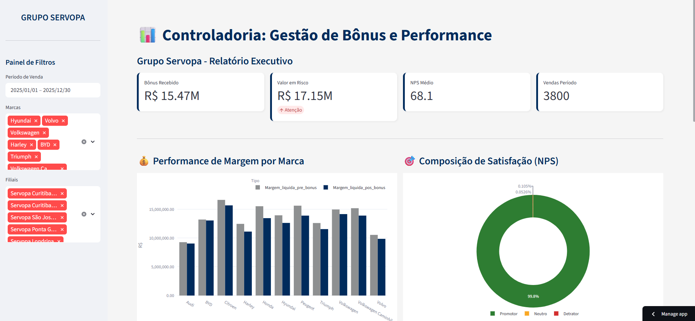
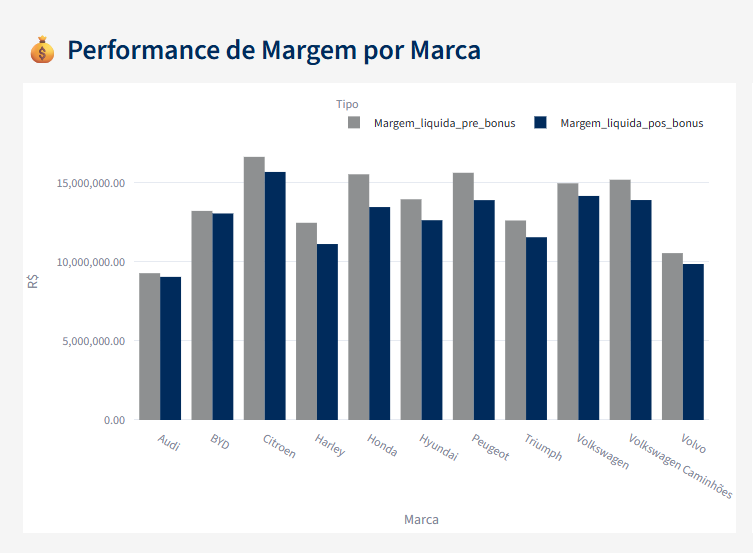
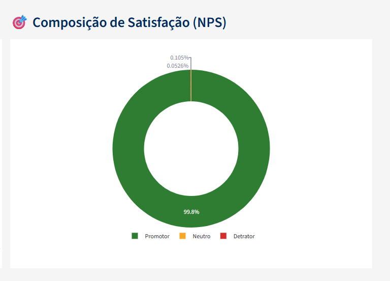
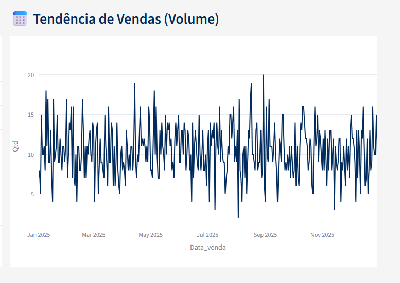
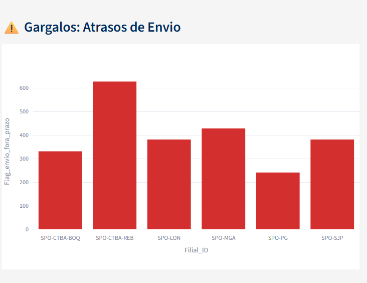
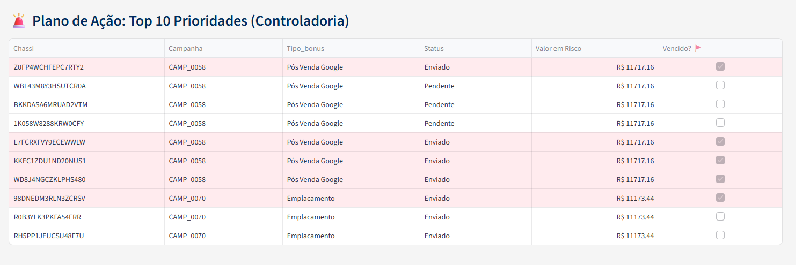

# 📊 Case Controladoria: Gestão de Bônus & Performance
### 🚗 Grupo Servopa | Business Intelligence & Data Analytics

Este repositório contém a solução desenvolvida para o case técnico da **Controladoria do Grupo Servopa**. O projeto foca na integração de dados para monitoramento de bônus de montadoras, rentabilidade real e satisfação de clientes (NPS).

---

## 🔗 Acesso ao Projeto
🚀 **Dashboard Interativo:** [CLIQUE AQUI PARA ACESSAR O APP](https://case-servopa-dashboard-rcqvgfqcx7ka3wkb9ymba6.streamlit.app/)

---

## 🎯 Objetivo do Negócio
A ferramenta transforma dados brutos em decisões estratégicas, focando em:
* **Recuperação de Receita:** Identificação de valores pendentes de bônus.
* **Saúde Financeira:** Comparativo de Margem Líquida (Pré vs. Pós Bônus).
* **Eficiência Operacional:** Identificação de filiais com atrasos no envio de processos.
* **Qualidade:** Monitoramento da satisfação do cliente final (NPS).

---

## 🖼️ Visualização do Dashboard

### 1. Visão Geral e KPIs
Abaixo, a visão principal com os indicadores consolidados de bônus recebidos, valores em risco e volume de vendas.


> *Figura 1: Monitoramento de bônus e volume de vendas em tempo real.*

### 2. Análise de Margem e Satisfação (NPS)
Nesta seção, comparamos a lucratividade por marca e a distribuição de perfis de clientes (Promotores, Neutros e Detratores).



> *Figura 2: Impacto do bônus na margem por marca e composição do NPS.*

### 3. Tendência de Vendas e Gargalos Operacionais
Análise do volume de vendas ao longo do tempo e identificação das filiais com maior índice de atraso no envio de processos de bônus.



> *Figura 3: Evolução temporal de vendas e diagnóstico de atrasos por unidade.*

### 4. Gestão de Atrasos e Plano de Ação
Detalhamento das filiais com maior gargalo operacional e a tabela de prioridades para cobrança imediata.


> *Figura 3: Diagnóstico de gargalos operacionais e Top 10 chassis em risco.*

---

## 🛡️ Diferencial Técnico: Saneamento de Dados (ETL)
Um ponto crítico resolvido via **Python** foi o tratamento de inconsistências severas na base original:
* **Eliminação de Outliers:** Filtro automático para corrigir valores na casa dos quintilhões ($2 \times 10^{18}$), garantindo a fidedignidade dos relatórios.
* **Deduplicação:** Tratamento de registros para evitar inflação de margens em chassis com múltiplas campanhas.
* **Padronização:** Normalização de tipos numéricos e formatos de data via Pandas.

---

## 🛠️ Tecnologias Utilizadas
* **Linguagem:** Python 3.14
* **Interface:** Streamlit
* **Processamento:** Pandas
* **Gráficos:** Plotly Express
* **Deploy:** Streamlit Cloud

---

## 📁 Estrutura do Repositório
* `dashboard.py`: Código principal da aplicação.
* `requirements.txt`: Dependências para o deploy.
* `controle_de_bonus_case.xlsx`: Base de dados utilizada.
* `README.md`: Documentação do projeto.

---

## ⚙️ Como Executar Localmente
1. Clone o repositório:
   ```bash
   git clone [https://github.com/seu-usuario/case-servopa.git](https://github.com/seu-usuario/case-servopa.git)
